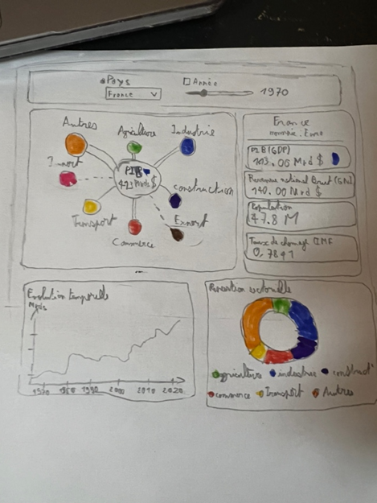
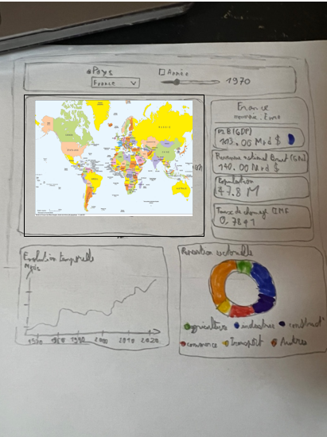

# Document de Cadrage – Visualisation de l’Économie Mondiale

## 1. Problématique abordée

L’objectif du projet est de comprendre comment évolue l’économie mondiale et d’identifier les facteurs qui influencent cette évolution à différentes échelles spatiales et temporelles.

Plus précisément, le projet cherche à répondre aux questions suivantes :

* Comment évoluent les principaux indicateurs macroéconomiques au fil du temps (PIB, GNI, population, inflation, importations/exportations) ?
* Quels facteurs contribuent le plus à la croissance économique selon les pays ?
* La structure sectorielle de l’économie (agriculture, industrie, construction, commerce, transport, autres activités) influence-t-elle l’évolution du PIB ?
* Quelle relation existe-t-il entre les flux commerciaux (importations/exportations) et la croissance économique ?
* Comment ces indicateurs ont-ils réagi lors de crises majeures, telles que la crise financière de 2007–2008 ou la pandémie de Covid-19 ?
* Peut-on observer un lien entre le bien-être ou la satisfaction économique des populations et les performances macroéconomiques ?
* *(Bonus)* Est-il possible de proposer une projection simple ou une tendance future des indicateurs économiques à partir des données historiques ?

## 2. Public cible et tâches réalisées via la visualisation

### Public cible

La visualisation s’adresse principalement :

* Aux étudiants et chercheurs en économie
* Aux journalistes économiques et analystes
* Aux décideurs publics et institutions
* À toute personne intéressée par l’évolution de l’économie mondiale

### Tâches rendues possibles par la visualisation

* Explorer l’évolution temporelle du PIB par pays
* Comparer la contribution des différents secteurs économiques au PIB
* Analyser les variations des importations et exportations et leur incidence sur la croissance
* Visualiser l’impact des crises économiques majeures
* Comparer plusieurs pays à l’aide de graphiques interactifs
* Naviguer dans les données grâce à une interface permettant le filtrage par pays, année et indicateurs

## 3. Questions d’analyse principales

### Population et croissance

* Quel est le rôle de la démographie dans l’évolution du PIB ?

### Structure sectorielle du PIB

* Comment le PIB est-il réparti entre les différents secteurs (agriculture, industrie, commerce, transport, etc.) ?
* Quels secteurs sont moteurs de la croissance selon les pays ?

### Commerce international

* Existe-t-il une corrélation entre les flux d’importations/exportations et la croissance économique ?

### Évolution temporelle

* Comment évoluent le PIB, le GNI, l’inflation et les échanges commerciaux au fil des années ?

### Impact des crises économiques

* Comment les indicateurs macroéconomiques ont-ils été affectés lors de la crise financière de 2007–2008 ?
* Quels effets observe-t-on pendant la pandémie de Covid-19 ?

### Bien-être économique

* Peut-on établir un lien entre indicateurs économiques et niveau de satisfaction ou de bien-être des populations ?

### Prévisions *(bonus)*

* Peut-on proposer une projection simple des tendances futures (régression linéaire, lissage) à partir des données disponibles ?

## 4. Sources de données sélectionnées

### Sources principales

* **Global Economy Indicators (Kaggle)** – source principale regroupant de nombreux indicateurs macroéconomiques mondiaux
  [https://www.kaggle.com/datasets/prasad22/global-economy-indicators](https://www.kaggle.com/datasets/prasad22/global-economy-indicators)

* **World Bank – World Development Indicators (WDI)**
  [https://data360.worldbank.org/en/dataset/WB_WDI](https://data360.worldbank.org/en/dataset/WB_WDI)

* **OECD – Better Life Index** (bien-être et satisfaction)
  [https://www.oecd.org/en/data/tools/oecd-better-life-index.html](https://www.oecd.org/en/data/tools/oecd-better-life-index.html)

### Travaux connexes et inspirations

* **Our World in Data – Economic Growth**
  [https://ourworldindata.org/economic-growth](https://ourworldindata.org/economic-growth)

* **TheGlobalEconomy.com – GDP per capita (PPP)**
  [https://www.theglobaleconomy.com](https://www.theglobaleconomy.com)

* **Bureau of Labor Statistics – Graphics for Economic News Releases**
  [https://www.bls.gov/charts/](https://www.bls.gov/charts/)

## 5. Organisation du travail

### Moyens de communication

* **Discord** pour la communication instantanée
* **GitHub** pour le dépôt du code, le suivi du projet et la gestion des issues et milestones

### Sessions de travail prévues (hors cours)

* Réunions régulières en groupe selon une méthodologie de type Agile
* Points hebdomadaires pour valider l’avancement et redistribuer les tâches
* Sessions individuelles ou en sous-groupes dédiées à :

  * Nettoyage et intégration des données
  * Création des visualisations D3.js
  * Développement de l’interface utilisateur

### Répartition des rôles (non exclusifs)

1. **Data Cleaning** : gestion des données manquantes, outliers et normalisation *(tout le groupe)*
2. **Data Merging** : fusion des données World Bank et OECD Better Life Index *(Julia)*
3. **Priorisation des questions** : sélection des visualisations les plus pertinentes
4. **Visualisation D3.js** : conception et développement des graphiques interactifs
5. **Développement de l’interface utilisateur** : filtres, contrôles et interactions
6. **Documentation et présentation** : rédaction du rendu final et préparation de la soutenance

## 6. Scan des esquisses finales

*(Les esquisses finales de l’interface et des visualisations sont présentées ci-dessous.)*

* Image 1 : 
* Image 2 : 
